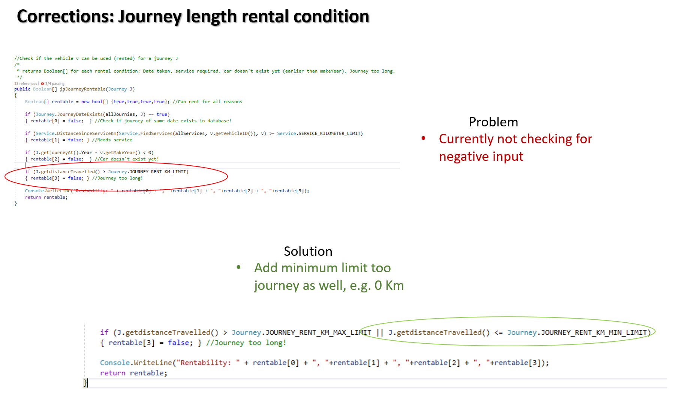
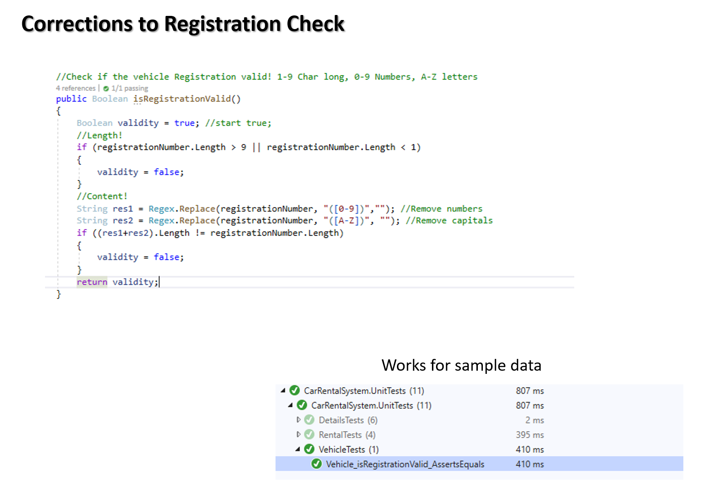

# Assignment2-OSStarterCode- Car Rental App
## Table Of contents 
- **[Description](#Description)**<br>
- **[Features](#Features)**<br>
- **[Prerequisites](#Prerequisites)**<br>
- **[Installing](#Installing)**<br>
- **[Design](#Design)**<br>
- **[Testing](#Testing)**<br>


## Description
A BREAD web app tool to manage a vehicle rental system.
The Program is written in C#.

## Features
Database management for vehicles and their journies, services and fuel purchases using the BREAD approach (Browse, Read, Edit, Add, Delete).

Program has both mySQL load and save, and text file (JSON) load and save for all data fields.

A basic user can browse the vehicle list, select vehicles to view their details and create journies they would like to rent a vehicle for. The program is missing a customer database, but the journies can have status changed from unpaid to paid using fake admin details in this version (Admin1, Password1). The cost is calculated and limits are placed on Journies for rent:
  -1 Journey per car per day.
  -Cannot journey when vehicle service required.
  -Cannot rent a journey before the makeYear of the vehicle
  -Cannot journey more than 500KM at once

Using the admin tools vehicle histories for a selected vehicle are viewable and may be editted, added or deleted 
Histories include services, journies and fuel purchases.

## Prerequisites
Visual studio with C# and mySQL (see Installation below)

## Installing
### STEP 1: Create MySQL database and User

```bash
mysql -u root 
```

```sql 
CREATE DATABASE `cars` CHARACTER SET 'utf8mb4' COLLATE 'utf8mb4_general_ci';
CREATE DATABASE `cars_test` CHARACTER SET 'utf8mb4' COLLATE 'utf8mb4_general_ci';

CREATE USER 'cars'@'localhost' IDENTIFIED WITH mysql_native_password BY 'Password1';

GRANT ALL PRIVILEGES ON cars.* TO 'cars'@'localhost';
GRANT ALL PRIVILEGES ON cars_test.* TO 'cars'@'localhost';

GRANT USAGE ON *.* TO 'cars'@'localhost';
FLUSH PRIVILEGES;

USE cars;
```

MySQL statement 
```sql
CREATE TABLE `fuelpurchases` (
  `id` int(11) NOT NULL AUTO_INCREMENT,
  `vehicleid` int(11) NOT NULL,
  `amount` int(11) DEFAULT NULL,
  `price` double DEFAULT NULL,
  `created` datetime DEFAULT NULL,
  `updated` datetime DEFAULT NULL,
  PRIMARY KEY (`id`)
) ENGINE=InnoDB AUTO_INCREMENT=5 DEFAULT CHARSET=utf8mb4 COLLATE=utf8mb4_0900_ai_ci;
```
```sql
CREATE TABLE `journies` (
  `id` int(11) NOT NULL AUTO_INCREMENT,
  `vehicleid` int(11) NOT NULL,
  `distanceTravelled` int(11) DEFAULT NULL,
  `journeyAt` datetime DEFAULT NULL,
  `created` datetime DEFAULT NULL,
  `updated` datetime DEFAULT NULL,
  `paid` int(11) DEFAULT '0',
  PRIMARY KEY (`id`)
) ENGINE=InnoDB AUTO_INCREMENT=6 DEFAULT CHARSET=utf8mb4 COLLATE=utf8mb4_0900_ai_ci;
```
```sql
CREATE TABLE `services` (
  `id` int(11) NOT NULL AUTO_INCREMENT,
  `vehicleid` int(11) NOT NULL,
  `odometer` int(11) DEFAULT NULL,
  `serviceCount` int(11) DEFAULT NULL,
  `serviceDate` datetime DEFAULT NULL,
  `created` datetime DEFAULT NULL,
  `updated` datetime DEFAULT NULL,
  PRIMARY KEY (`id`)
) ENGINE=InnoDB AUTO_INCREMENT=5 DEFAULT CHARSET=utf8mb4 COLLATE=utf8mb4_0900_ai_ci;
```
```sql
CREATE TABLE `vehicles` (
  `id` int(11) NOT NULL AUTO_INCREMENT,
  `vehicleid` int(11) NOT NULL,
  `model` mediumtext,
  `manufacturer` mediumtext,
  `makeyear` int(11) DEFAULT NULL,
  `odometer` int(11) DEFAULT NULL,
  `registration` mediumtext,
  `tankcapacity` int(11) DEFAULT NULL,
  PRIMARY KEY (`id`)
) ENGINE=InnoDB AUTO_INCREMENT=23 DEFAULT CHARSET=utf8mb4 COLLATE=utf8mb4_0900_ai_ci;
```
Note: MySQL default port is 3306
### Step 2: Clone the repo
```bash  
https://github.com/Mycol-Cara/Assignment2-OSStarterCode-Mik
```
### Step 3: Install NuGet Packages
- NewtonSoft.Json
- MySql Commands

### Step 4: Prepare initial data for JSON (.txt) load in
- Download and Copy .txt save files from databaseBackUp to bin\Debug\ (the base directory of the application)


## Design
### Screenshots


## Testing
### Create Unit Tests
- Go to the solution 'CarRentalSystem' at the very top of Solutione explorer
- Right Click on the solution
- Add New Project 
- Choose Unit Test Project
- In the unit test project, add a reference to the project you want to test by right-clicking on References or Dependencies and then      choosing Add Reference.


## Testing Screenshots








This repository contains the classes for the vehicle rental system.
You can modify and extend the existing code as well as add new classes to make the application functional and user-friendly.
The User Interface can be either GUI or console based.
Git source control must be used to track different versions of the application over time.
